# 🧠 MindMitra

## Explainable AI-Based Personal Wellbeing Monitoring and Prediction System

MindMitra is a full-stack, Explainable AI-based personal wellbeing monitoring and prediction system that combines Machine Learning, Personal Baseline Analysis, Digital Wellbeing, Mood Tracking, SHAP Explainability, Wellness Activities, Personalized Daily Planning, and an AI Companion into a single web application.

The main idea of MindMitra is:

> **Predict → Explain → Personalize → Guide**

The system does not only provide a numerical prediction. It also attempts to explain the prediction, compare the user's current pattern with their personal baseline, communicate input completeness, and provide personalized wellness-oriented guidance.

> **Disclaimer:** MindMitra is an academic wellbeing-monitoring prototype. It is not a medical diagnosis or treatment system.

---

# 📑 Table of Contents

1. [Project Overview](#-project-overview)
2. [Problem Statement](#-problem-statement)
3. [Motivation](#-motivation)
4. [Objectives](#-objectives)
5. [Proposed Solution](#-proposed-solution)
6. [Key Features](#-key-features)
7. [System Architecture](#-system-architecture)
8. [Complete Application Flow](#-complete-application-flow)
9. [Technology Stack](#-technology-stack)
10. [Machine Learning](#-machine-learning)
11. [Dataset](#-dataset)
12. [Target Variables](#-target-variables)
13. [Data Preprocessing](#-data-preprocessing)
14. [Feature Engineering](#-feature-engineering)
15. [Model Development](#-model-development)
16. [Model Evaluation](#-model-evaluation)
17. [Model Results](#-model-results)
18. [Model Interpretation](#-model-interpretation)
19. [SHAP Explainable AI](#-shap-explainable-ai)
20. [Personal Baseline](#-personal-baseline)
21. [Change Detection](#-change-detection)
22. [Data Provenance](#-data-provenance)
23. [Data Confidence](#-data-confidence)
24. [Digital Wellbeing](#-digital-wellbeing)
25. [Mood Diary](#-mood-diary)
26. [Wellness Activities](#-wellness-activities)
27. [Personalized Full-Day Roadmap](#-personalized-full-day-roadmap)
28. [Mitra AI Companion](#-mitra-ai-companion)
29. [Authentication and Security](#-authentication-and-security)
30. [Database Design](#-database-design)
31. [REST API Architecture](#-rest-api-architecture)
32. [FastAPI ML Service](#-fastapi-ml-service)
33. [Frontend Architecture](#-frontend-architecture)
34. [Backend Architecture](#-backend-architecture)
35. [ML Service Architecture](#-ml-service-architecture)
36. [Project Structure](#-project-structure)
37. [End-to-End Data Flow](#-end-to-end-data-flow)
38. [Testing](#-testing)
39. [Running the Project](#-running-the-project)
40. [Environment Variables](#-environment-variables)
41. [Development Workflow](#-development-workflow)
42. [Limitations](#-limitations)
43. [Ethical and Privacy Considerations](#-ethical-and-privacy-considerations)
44. [Future Scope](#-future-scope)
45. [Academic Value](#-academic-value)
46. [Research Interpretation](#-research-interpretation)
47. [Conclusion](#-conclusion)
48. [Disclaimer](#-disclaimer)

---

# 📌 Project Overview

MindMitra is an Explainable AI-based personal wellbeing monitoring and prediction system developed as an academic CSE project.

The system combines:

- Machine Learning
- Explainable AI
- Personal Baseline Analysis
- Digital Wellbeing
- Mood Tracking
- Wellness Activities
- Personalized Daily Planning
- Data Confidence
- Conversational AI

The system is designed around three main questions:

### 1. What is the current predicted state?

The ML model predicts a rested/fatigue-related score using available information.

### 2. Why did the model generate this prediction?

SHAP is used to identify feature contributions to individual predictions.

### 3. What can the user do next?

MindMitra uses personal information, baseline changes, and rule-based wellness logic to provide activities and a full-day roadmap.

---

# ❗ Problem Statement

Many existing wellbeing applications provide tracking features or generic recommendations, but users may still have difficulty understanding:

- Why their current state changed
- Which factors contributed to a prediction
- How today's pattern differs from their normal pattern
- How complete the data used by the system is
- What wellness activities may be relevant to their current situation

A conventional application may simply display:

```text
Current Score: 24
```

without explaining how that score was generated.

MindMitra attempts to address this by integrating:

```text
User Data
     ↓
Machine Learning
     ↓
Prediction
     ↓
SHAP Explanation
     ↓
Personal Baseline
     ↓
Data Confidence
     ↓
Personalized Guidance
```

---

# 💡 Motivation

The motivation behind MindMitra is to make AI-based wellbeing monitoring more understandable and personalized.

A prediction without an explanation can behave like a black box.

Therefore, the project focuses on:

```text
Prediction
    +
Explanation
    +
Personalization
    +
Guidance
```

The goal is not only to generate a prediction, but also to provide understandable context around it.

---

# 🎯 Objectives

The major objectives of MindMitra are:

1. Develop a complete full-stack wellbeing monitoring application.
2. Build a machine-learning pipeline for rested/fatigue-related prediction.
3. Compare Random Forest and XGBoost regression models.
4. Evaluate models using MAE, RMSE, and R².
5. Use SHAP for local model explanations.
6. Build a personal baseline using previous check-ins.
7. Detect changes from a user's normal pattern.
8. Integrate digital wellbeing information.
9. Track mood history.
10. Provide wellness activities.
11. Generate a personalized full-day roadmap.
12. Provide a data-confidence/input-completeness indicator.
13. Provide an AI companion for natural-language explanation and general wellness guidance.
14. Implement user authentication and ownership-based data access.
15. Store application data using MongoDB.
16. Expose the Python ML pipeline through FastAPI.
17. Connect the React frontend, Node.js backend, MongoDB database, and Python ML service into one application.

---

# 💡 Proposed Solution

MindMitra uses a layered architecture.

```text
                    MINDMITRA
                       |
       +---------------+---------------+
       |               |               |
    PREDICT         EXPLAIN       PERSONALIZE
       |               |               |
      ML              SHAP          BASELINE
       |               |               |
       +---------------+---------------+
                       |
                WELLNESS GUIDANCE
                       |
                DAILY ROADMAP
```

The application combines machine learning with application-level personalization and rule-based wellness logic.

---

# ✨ Key Features

## 🧠 1. Wellbeing / Fatigue Prediction

MindMitra predicts a rested/fatigue-related score using available information.

Potential inputs include:

- Sleep duration
- Sleep quality
- Stress level
- Physical activity
- Screen time
- Social-media usage
- Night screen time
- User profile
- Work routine
- Other available lifestyle variables

---

## 📝 2. Flexible Daily Check-In

Users can submit daily information through a check-in interface.

The check-in can include:

- Sleep duration
- Stress level
- Sleep quality
- Physical activity
- Digital wellbeing information
- Other available lifestyle information

After submission, the backend prepares an ML payload and sends it to the FastAPI service.

---

## 📊 3. Prediction History

Predictions are stored in MongoDB.

Users can view historical information including:

- Previous predictions
- Prediction trends
- SHAP explanations
- Baseline changes
- Related wellbeing information

---

## 👤 4. Personal Baseline

MindMitra attempts to understand the user's normal pattern.

Instead of comparing every user against the same fixed standard, the system compares the current state with the user's historical information.

Example:

```text
PERSONAL BASELINE
-----------------
Sleep       : 7.4 hours
Stress      : 4

TODAY
-----------------
Sleep       : 5.5 hours
Stress      : 8
```

This allows the system to communicate that the current pattern differs from the user's recent baseline.

---

## 🔎 5. SHAP Explainability

MindMitra uses SHAP to explain individual predictions.

Instead of only displaying:

```text
Prediction = 24.24
```

the application can show feature contributions such as:

```text
Sleep Duration
    ↓
Negative Contribution

Stress Level
    ↓
Negative Contribution

Night Screen Time
    ↓
Small Contribution
```

---

## 📱 6. Digital Wellbeing

MindMitra supports digital wellbeing information such as:

- Total screen time
- Social-media usage
- Night screen time
- Most-used app/category
- Change from baseline

The current web application uses available/user-provided information.

Automatic phone-level integration requires appropriate platform APIs and permissions and is considered future scope.

---

## 😊 7. Mood Diary

Users can record their daily mood.

The mood diary provides historical information that can be viewed alongside:

- Predictions
- Sleep
- Stress
- Digital wellbeing
- Baseline changes

---

## 🧘 8. Wellness Activities

MindMitra includes activities from categories such as:

- Breathing
- Meditation
- Movement
- Relaxation
- Music
- Sleep Routine

Activities can be recommended using application-level rules.

---

## 🗓️ 9. Personalized Full-Day Roadmap

The system generates a roadmap divided into:

```text
🌅 Morning
☀️ Afternoon
🌆 Evening
🌙 Night
```

The roadmap can consider:

- Current check-in
- Sleep
- Stress
- Digital wellbeing
- Mood
- Personal baseline
- Available wellness activities

---

## 📈 10. Data Confidence

MindMitra tracks the source of ML input values.

Supported provenance categories include:

```text
user_input
digital_wellbeing
user_profile
default
```

The Data Confidence indicator represents input completeness.

It does not represent model accuracy or medical certainty.

---

## 💬 11. Mitra AI Companion

Mitra is the conversational AI component.

It can:

- Explain existing predictions
- Explain SHAP factors
- Answer general wellbeing questions
- Provide general wellness guidance
- Use relevant application context

Mitra does not generate the numerical ML prediction or SHAP values.

---

# 🏗️ System Architecture

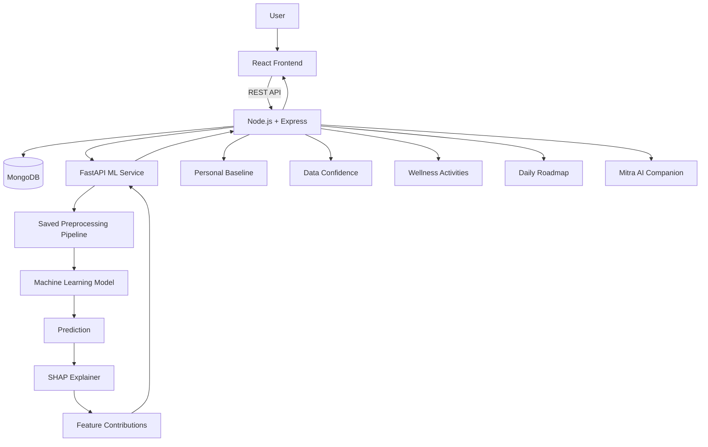

---

# 🔄 Complete Application Flow

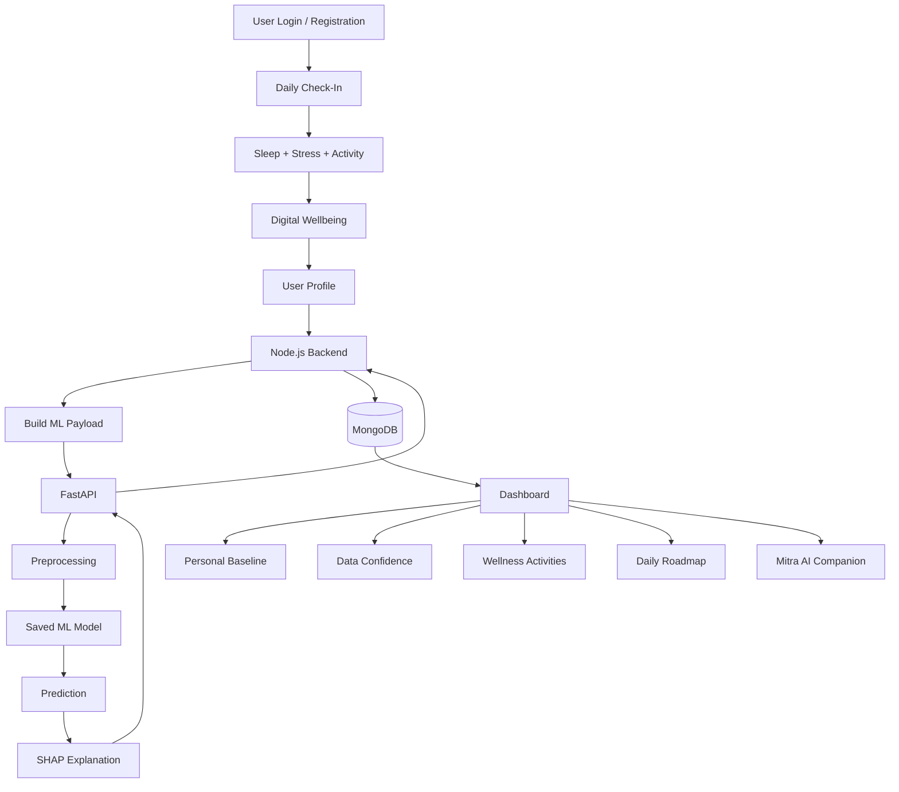

---

# 🛠️ Technology Stack

| Layer | Technology |
|---|---|
| Frontend | React |
| Build Tool | Vite |
| Frontend Language | JavaScript |
| Styling | CSS / Tailwind CSS |
| Charts | Recharts |
| Icons | Lucide React |
| Backend | Node.js |
| API Framework | Express.js |
| Database | MongoDB |
| ODM | Mongoose |
| Authentication | JWT |
| Password Security | bcrypt |
| ML Language | Python |
| Data Processing | Pandas |
| Numerical Computing | NumPy |
| ML Framework | Scikit-learn |
| Gradient Boosting | XGBoost |
| Explainability | SHAP |
| Model Serialization | Joblib |
| ML API | FastAPI |
| ASGI Server | Uvicorn |
| Validation | Pydantic |
| Version Control | Git |
| Repository | GitHub |

---

# 🧠 Machine Learning

MindMitra uses supervised machine learning for regression.

The ML pipeline contains:

```text
Dataset
   ↓
Data Profiling
   ↓
Data Cleaning
   ↓
Feature Selection
   ↓
Train/Test Split
   ↓
Preprocessing
   ↓
Model Training
   ↓
Model Evaluation
   ↓
Model Saving
   ↓
FastAPI Inference
   ↓
SHAP Explanation
```

---

# 📚 Dataset

MindMitra uses the:

**100K Sleep Health & Daily Performance Dataset**

The dataset contains:

- 100,000 records
- 32 documented features
- Lifestyle information
- Sleep-related information
- Stress information
- Physical activity information
- Work-related information
- Digital/lifestyle variables
- Other personal/physiological variables

The dataset is **synthetic**.

Therefore, it should not be described as data collected from 100,000 real participants.

---

# 🎯 Target Variables

## Primary Target: `felt_rested`

The primary target is:

```text
felt_rested
```

The values are represented from 1 to 100.

For MindMitra, this variable is used as:

> A proxy target representing the user's rested/fatigue-related state.

It is not treated as a clinically validated wellbeing score.

The target is handled as a regression problem.

---

## Secondary Target: `cognitive_performance_score`

The project also includes:

```text
cognitive_performance_score
```

as a secondary regression target.

---

# 🧹 Data Preprocessing

The project uses Scikit-learn preprocessing pipelines.

The preprocessing includes:

- Numerical feature processing
- Missing-value handling
- Categorical feature processing
- One-hot encoding
- Consistent transformations between training and inference

The preprocessing pipeline is fitted using training data and then reused for test data and application inference.

---

# 🔢 Numerical Features

Numerical features are processed using appropriate numerical preprocessing.

Missing numerical values can be handled using median-based imputation.

---

# 🔤 Categorical Features

Categorical variables are processed using:

- Missing-value handling
- One-hot encoding

The encoder uses:

```text
handle_unknown = ignore
```

This helps prevent inference failures when an unseen categorical value is encountered.

---

# 🔐 Data Leakage Prevention

Potential target leakage was examined during model development.

For the primary `felt_rested` model:

```text
cognitive_performance_score
```

was excluded as an input because it is another target variable.

The preprocessing pipeline is fitted only on training data.

The test set is transformed using the already-fitted preprocessing pipeline.

---

# 📊 Train-Test Split

The project uses:

```text
80% Training
20% Testing
```

with:

```text
random_state = 42
```

This provides a reproducible split.

---

# ⚙️ Feature Representation

After preprocessing:

### Felt-Rested Model

The model uses approximately:

```text
68 transformed features
```

### Cognitive Model

The model uses approximately:

```text
69 transformed features
```

Categorical variables increase the number of transformed features because they are one-hot encoded.

---

# 🤖 Model Development

Two primary regression models were trained and compared.

---

## 🌲 Random Forest Regressor

Configuration:

```text
n_estimators = 100
random_state = 42
n_jobs = -1
```

Random Forest was selected because it can model nonlinear relationships in structured/tabular data.

---

## ⚡ XGBoost Regressor

Configuration:

```text
n_estimators = 100
random_state = 42
n_jobs = -1
```

XGBoost was selected as a gradient-boosted tree model for structured data.

---

# 📏 Evaluation Metrics

The project evaluates regression models using:

## MAE

Mean Absolute Error:

```text
MAE = Average(|Actual - Predicted|)
```

Lower values indicate smaller average absolute errors.

---

## RMSE

Root Mean Squared Error gives greater weight to larger errors.

Lower values indicate smaller prediction errors.

---

## R²

R² measures the proportion of target variation explained by the model relative to a baseline.

Higher values indicate a better fit on the evaluated data.

---

# 📊 Model Results

## Felt-Rested Prediction

| Model | MAE | RMSE | R² |
|---|---:|---:|---:|
| Random Forest | 0.151 | 0.320 | 0.9996 |
| XGBoost | 0.247 | 0.334 | 0.9996 |

---

## Cognitive Performance Prediction

| Model | MAE | RMSE | R² |
|---|---:|---:|---:|
| Random Forest | 0.143 | 0.263 | 0.9989 |
| XGBoost | 0.279 | 0.350 | 0.9981 |

---

# ⚠️ Interpretation of Results

The model scores are very high because the dataset is synthetic and contains strong relationships between some input variables and target variables.

Therefore:

```text
High R² on the synthetic dataset
        ≠
Clinical validity
```

and:

```text
Low test error
        ≠
Guaranteed real-world performance
```

The results demonstrate that the models successfully learn patterns present in the available dataset.

They do not establish real-world or clinical performance.

---

# 🔍 Feature Importance

Diagnostic analysis showed that the models relied heavily on a small number of features.

For the felt-rested model, important variables included:

```text
Sleep Duration
Stress Level
Night Screen Time
```

For the cognitive-performance model, important variables included:

```text
Felt-Rested Score
Physical Activity
Alcohol Consumption
```

These observations are specific to the current synthetic dataset and model.

They should not automatically be interpreted as universal real-world causal relationships.

---

# 🔎 SHAP Explainable AI

MindMitra uses:

**SHAP — SHapley Additive exPlanations**

to explain individual model predictions.

The main explainability implementation uses a tree-based SHAP explainer for the XGBoost models.

---

# 🧮 SHAP Concept

A model prediction can be represented conceptually as:

```text
Base Value
     +
Feature Contributions
     =
Final Prediction
```

Example:

```text
Base Value
43.55

Sleep Duration
-11.95

Stress Level
-7.39

Night Screen Time
+0.08

Prediction
24.24
```

A negative contribution means that the feature moved the model output downward relative to the model's baseline.

A positive contribution means that the feature moved the output upward.

---

# 🔬 SHAP Architecture

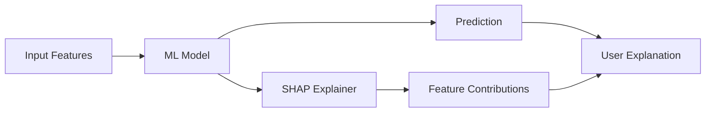

---

# 📊 Local Explanation

MindMitra provides local explanations for individual predictions.

Example:

```text
Prediction = 24.24

Top Contributors:

1. Sleep Duration
   Contribution = -11.95

2. Stress Level
   Contribution = -7.39

3. Night Screen Time
   Contribution = +0.08
```

The application can rank contributions by their absolute magnitude.

---

# 🌍 Global Explanation

SHAP can also be used to calculate average feature contribution across representative samples.

Observed model-specific patterns include:

### Felt-Rested Model

- Sleep duration
- Stress level
- Night screen time

### Cognitive Model

- Felt-rested score
- Alcohol consumption
- Physical activity

These values describe model behavior on the current dataset.

---

# ⚠️ SHAP Limitation

SHAP explains the mathematical behavior of the model.

It does not prove that a feature caused the real-world outcome.

Therefore:

```text
SHAP Contribution
        ≠
Causal Effect
```

---

# 👤 Personal Baseline

MindMitra includes a personal baseline system.

The baseline uses previous check-ins to estimate a user's normal recent pattern.

The current implementation requires sufficient historical check-in data before a baseline can be established.

The baseline can consider:

- Sleep
- Stress
- Physical activity

---

# 📊 Baseline Example

```text
PERSONAL BASELINE
-------------------------
Sleep       7.4 hours
Stress      4
Activity    45 minutes

TODAY
-------------------------
Sleep       5.5 hours
Stress      8
Activity    20 minutes
```

The application can then identify that today's values differ from the user's historical pattern.

---

# 🔄 Change Detection

MindMitra can generate messages such as:

```text
Your current sleep is below your recent baseline.
```

or:

```text
Your current stress level is higher than your recent pattern.
```

The purpose is to provide personalized context rather than comparing every user against the same fixed threshold.

---

# 🧾 Data Provenance

Every important ML input can be associated with its source.

The main categories are:

```text
user_input
digital_wellbeing
user_profile
default
```

Example:

```text
Sleep Duration
    ↓
user_input

Screen Time
    ↓
digital_wellbeing

Age
    ↓
user_profile

Country
    ↓
default
```

This makes it possible to distinguish actual user information from fallback values.

---

# 📈 Data Confidence

The Data Confidence feature measures the completeness of tracked ML inputs.

Example:

```text
14 / 29 tracked inputs available
        ↓
Input completeness
        ↓
48%
```

This means:

```text
14 inputs came from available usable sources
out of
29 tracked ML inputs
```

It does not mean:

```text
Model Accuracy = 48%
```

It also does not represent medical confidence.

---

# 📊 Data Confidence Architecture

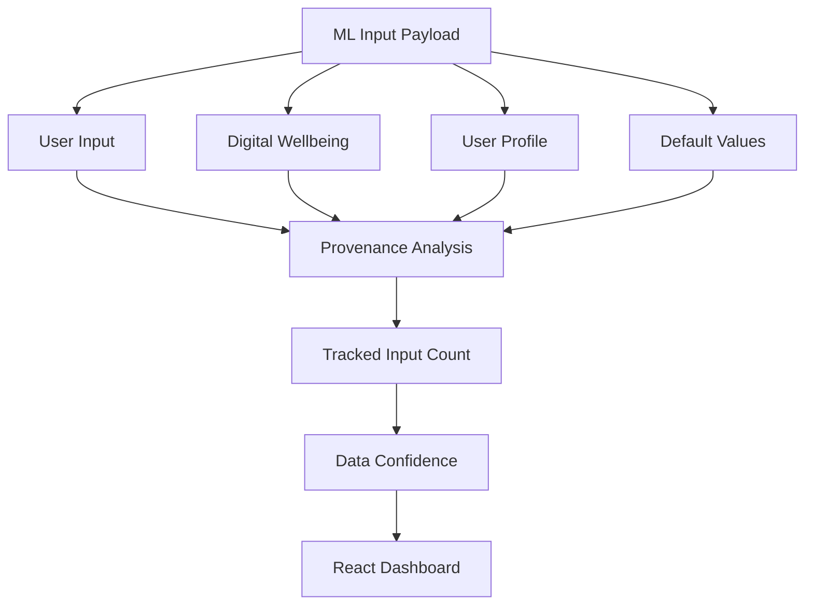

---

# 📱 Digital Wellbeing

MindMitra supports digital wellbeing information including:

- Total screen time
- Social-media minutes
- Night screen time
- Most-used app/category
- Change from baseline

---

# 📱 Digital Wellbeing Architecture

```text
User / Authorized Source
          ↓
Digital Wellbeing Data
          ↓
Node.js Backend
          ↓
MongoDB
          ↓
ML Payload
          ↓
FastAPI
```

---

# ⚠️ Digital Wellbeing Limitation

A normal web browser cannot freely read private phone application usage.

Automatic device-level tracking requires:

- User authorization
- Platform-specific APIs
- Appropriate permissions
- Potentially a companion mobile application

Therefore, automatic phone-level tracking is treated as future scope.

The current application can work with user-provided digital wellbeing information.

---

# 😊 Mood Diary

The Mood Diary allows users to maintain a history of mood information.

The diary can contain:

- Mood
- Optional note
- Date/time

Historical mood data can be displayed together with other wellbeing trends.

---

# 📊 Mood Flow

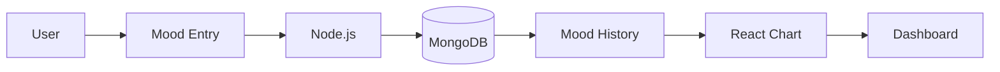

---

# 🧘 Wellness Activities

MindMitra includes a wellness activity catalog.

Activity categories include:

```text
Breathing
Meditation
Movement
Relaxation
Music
Sleep Routine
```

---

# 💡 Activity Recommendation Logic

Application-level rules can use current information.

Example:

```text
High Stress
    ↓
Breathing / Relaxation

Low Sleep
    ↓
Sleep Routine / Relaxation

Low Physical Activity
    ↓
Movement Activity

High Night Screen Time
    ↓
Night Routine
```

These recommendations are general wellness activities and are not medical treatments.

---

# 📋 Activity History

The system can maintain activity history including:

- Activity
- Start time
- Completion time
- Optional rating

---

# 🗓️ Personalized Full-Day Roadmap

MindMitra creates a daily roadmap with four periods:

```text
🌅 Morning
☀️ Afternoon
🌆 Evening
🌙 Night
```

---

# 🧠 Roadmap Architecture

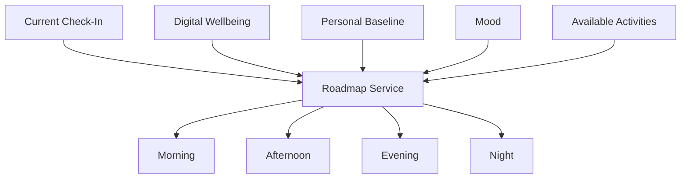

---

# 📝 Roadmap Example

```text
🌅 MORNING
----------------
Breathing Exercise
Reason:
Current stress is elevated.

☀️ AFTERNOON
----------------
Movement Break
Reason:
Recent activity is below the user's normal pattern.

🌆 EVENING
----------------
Relaxation Activity
Reason:
Current stress and activity pattern suggest adding a recovery period.

🌙 NIGHT
----------------
Sleep Routine
Reason:
Recent sleep duration is below the user's baseline.
```

---

# 🔍 Roadmap Reason vs SHAP

These two concepts are intentionally separate.

### SHAP

Explains:

```text
Why did the ML model produce this prediction?
```

### Roadmap Reason

Explains:

```text
Why did the application recommend this activity?
```

Therefore:

```text
SHAP
→ Model Explanation

Roadmap Logic
→ Application Recommendation Explanation
```

---

# 💬 Mitra AI Companion

Mitra is the conversational AI component of MindMitra.

The chatbot can use relevant application context to provide understandable responses.

---

# 🤖 Mitra Architecture

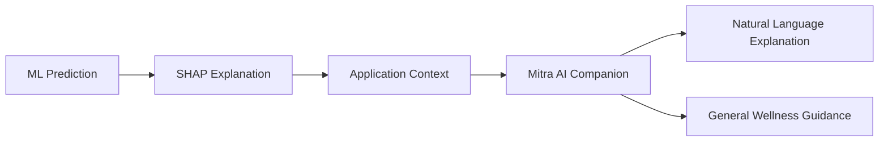

---

# 🧠 Mitra Context

The application can provide relevant context such as:

- Latest check-in
- Latest prediction
- SHAP factors
- Roadmap reasons
- Digital wellbeing information

The context does not include sensitive authentication secrets.

---

# 🔐 Mitra Security

The following information is excluded from chatbot context:

```text
Passwords
JWT Tokens
API Keys
Secrets
```

The chatbot is designed as an explanation and guidance layer.

It does not generate:

- Numerical ML predictions
- SHAP values
- Model artifacts

---

# 🤖 ML vs AI Companion

MindMitra separates the responsibilities of ML and the LLM.

```text
Machine Learning
      ↓
Numerical Prediction

SHAP
      ↓
Model Explanation

Mitra
      ↓
Natural Language Explanation
+
General Wellness Guidance
```

This separation prevents the chatbot from becoming the source of the numerical prediction.

---

# 🔐 Authentication and Security

MindMitra uses JWT-based authentication.

The authentication flow is:

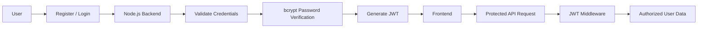

---

# 🔑 Authentication Features

- User registration
- User login
- Password hashing
- JWT authentication
- Protected routes
- User ownership validation
- Authenticated profile access
- User-specific data access

---

# 🔐 Password Security

Passwords are hashed using bcrypt before storage.

The application does not intentionally store passwords as plain text.

Sensitive environment variables are kept outside the source code.

---

# 👤 User Profile

MindMitra uses a user profile to reduce unnecessary hardcoded ML inputs.

The profile currently contains:

```text
Age
Gender
Occupation
Work Type
Work Hours Per Day
Commute Time
Bedtime
Wake-up Time
Workout Type
```

Profile values are used when available.

If a value is not available, the system can use a fallback value and record that the source was a default.

---

# 🗄️ Database Architecture

MongoDB is used as the application database.

The major models include:

```text
User
CheckIn
Prediction
MoodDiary
Roadmap
DigitalWellbeing
WellnessActivity
UserActivity
Feedback
ChatHistory
```

---

# 🗂️ Database Flow

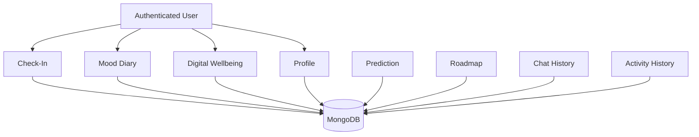

---

# 🧾 Main Database Models

## User

Stores:

- Name
- Email
- Password hash
- Profile information

---

## CheckIn

Stores daily user check-in information such as:

- Sleep
- Stress
- Sleep quality
- Physical activity
- Related lifestyle information

---

## Prediction

Stores:

- User
- Prediction value
- Target
- SHAP explanation
- Provenance
- Data quality/confidence
- Timestamp

---

## MoodDiary

Stores:

- User
- Mood
- Note
- Timestamp

---

## DigitalWellbeing

Stores:

- Total screen time
- Social-media minutes
- Night screen time
- Most-used app/category
- Timestamp

---

## Roadmap

Stores:

- User
- Date
- Morning items
- Afternoon items
- Evening items
- Night items
- Completion status
- Recommendation reasons

---

## WellnessActivity

Stores the reusable wellness activity catalog.

---

## UserActivity

Stores user activity history.

---

## ChatHistory

Stores authenticated Mitra conversations.

---

# 🌐 REST API Architecture

MindMitra uses REST APIs between the React frontend and Node.js backend.

The architecture is:

```text
React
  ↓
REST API
  ↓
Express
  ↓
Controller
  ↓
Service
  ↓
MongoDB / FastAPI
```

---

# 🔌 Authentication APIs

```text
POST /api/auth/register
POST /api/auth/login
GET  /api/auth/me
```

---

# 👤 Profile APIs

```text
GET /api/profile
PUT /api/profile
```

---

# 📝 Check-In APIs

```text
POST /api/checkins
GET  /api/checkins/user/:userId
```

---

# 📊 Prediction APIs

```text
POST /api/predictions
GET  /api/predictions/user/:userId
```

---

# 😊 Mood Diary APIs

```text
POST   /api/diary
GET    /api/diary/user/:userId
DELETE /api/diary/:id
```

---

# 📱 Digital Wellbeing APIs

```text
POST /api/wellbeing
GET  /api/wellbeing/user/:userId
```

---

# 🗓️ Roadmap APIs

```text
POST  /api/roadmap/generate
GET   /api/roadmap/today
GET   /api/roadmap/history
PATCH /api/roadmap/:id/items/:itemId/complete
```

---

# 🧘 Activity APIs

```text
GET  /api/activities
POST /api/activities/:id/start
POST /api/activities/:id/complete
GET  /api/activities/history
```

---

# 💬 Chatbot APIs

```text
POST /api/chatbot
GET  /api/chatbot/history
```

---

# 📝 Feedback API

```text
POST /api/feedback
```

---

# 🐍 FastAPI ML Service

The Python ML service is separated from the Node.js application.

Its main responsibility is:

> Load trained artifacts and perform ML inference.

---

# 🔌 FastAPI Endpoints

## Health Check

```text
GET /health
```

This verifies that the ML service is running.

---

## Prediction

```text
POST /predict
```

The endpoint:

1. Validates the request.
2. Loads the saved preprocessing pipeline.
3. Transforms the input.
4. Loads the trained model.
5. Generates the prediction.
6. Generates SHAP explanations.
7. Returns structured output.

---

# 🔄 Node.js → FastAPI Flow

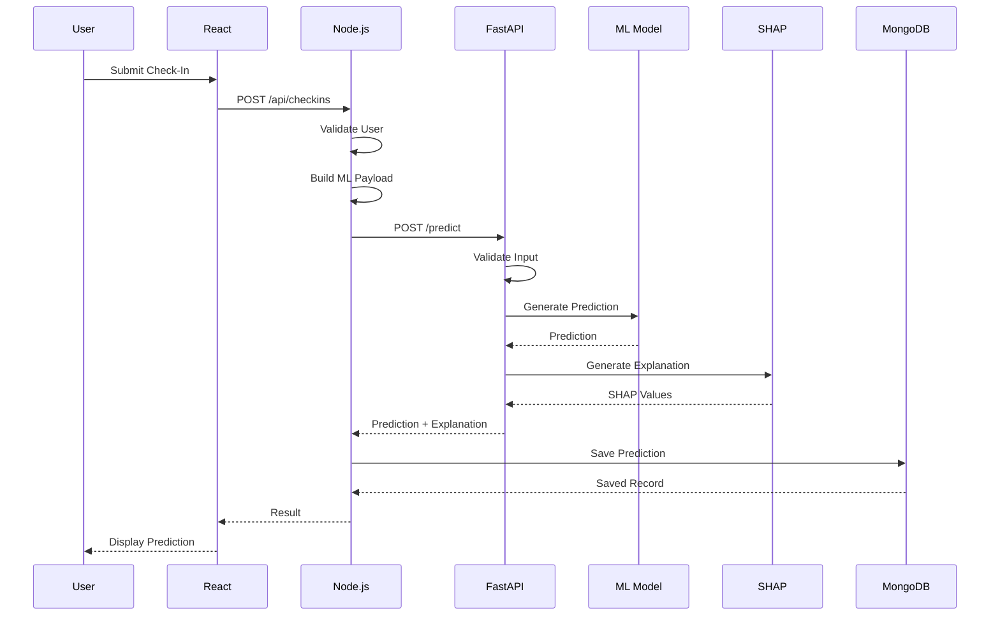

---

# 💾 Saved ML Artifacts

The ML project saves trained artifacts using Joblib.

Examples include:

```text
preprocessor_felt_rested.joblib
rf_felt_rested.joblib
xgboost_felt_rested.joblib
features_felt_rested.joblib
```

Corresponding artifacts are also maintained for the cognitive-performance model.

---

# 🚫 No Runtime Retraining

The live application does not retrain the model every time a user submits a check-in.

The architecture is:

```text
Offline Training
      ↓
Model Evaluation
      ↓
Saved Model
      ↓
FastAPI
      ↓
Live Inference
```

Periodic retraining is considered future scope.

---

# 🖥️ Frontend Architecture

The frontend is built using React and Vite.

Major application pages include:

```text
Dashboard
Check-In
Prediction
Roadmap
Mood Diary
Digital Wellbeing
Activities
AI Companion
Insights
Profile
About
```

---

# 🧩 Reusable Frontend Components

The application uses reusable components such as:

```text
Navbar
Sidebar
WellbeingScore
ConfidenceCard
BaselineCard
FactorCard
RoadmapTimeline
MoodChart
TrendChart
SHAPChart
ActivityCard
ChatMessage
```

These components help maintain a modular frontend structure.

---

# 🔧 Frontend Services

Frontend service modules communicate with the backend.

Examples include:

```text
api.js
predictionService.js
diaryService.js
roadmapService.js
wellbeingService.js
```

This keeps API communication separate from UI components.

---

# 🏗️ Backend Architecture

The backend follows a route-controller-service architecture.

```text
Request
   ↓
Route
   ↓
Controller
   ↓
Service
   ↓
MongoDB / FastAPI
   ↓
Response
```

---

# 📦 Backend Layers

## Routes

Define API endpoints.

## Controllers

Handle incoming requests and responses.

## Services

Contain reusable business logic.

## Models

Define MongoDB schemas.

## Middleware

Handles authentication and errors.

---

# 🐍 ML Service Architecture

The Python service follows:

```text
FastAPI
   ↓
Prediction Route
   ↓
Prediction Service
   ↓
Saved Preprocessor
   ↓
Saved ML Model
   ↓
SHAP Explainer
   ↓
Prediction Response
```

---

# 📂 Project Structure

```text
MindMitra/
│
├── frontend/
│   ├── public/
│   │   └── assets/
│   │
│   ├── src/
│   │   ├── components/
│   │   │   ├── Navbar.jsx
│   │   │   ├── Sidebar.jsx
│   │   │   ├── WellbeingScore.jsx
│   │   │   ├── ConfidenceCard.jsx
│   │   │   ├── BaselineCard.jsx
│   │   │   ├── FactorCard.jsx
│   │   │   ├── RoadmapTimeline.jsx
│   │   │   ├── MoodChart.jsx
│   │   │   ├── TrendChart.jsx
│   │   │   ├── SHAPChart.jsx
│   │   │   ├── ActivityCard.jsx
│   │   │   └── ChatMessage.jsx
│   │   │
│   │   ├── pages/
│   │   │   ├── Dashboard.jsx
│   │   │   ├── CheckIn.jsx
│   │   │   ├── Prediction.jsx
│   │   │   ├── Roadmap.jsx
│   │   │   ├── MoodDiary.jsx
│   │   │   ├── DigitalWellbeing.jsx
│   │   │   ├── Activities.jsx
│   │   │   ├── AICompanion.jsx
│   │   │   ├── Insights.jsx
│   │   │   └── About.jsx
│   │   │
│   │   ├── services/
│   │   │   ├── api.js
│   │   │   ├── predictionService.js
│   │   │   ├── diaryService.js
│   │   │   ├── roadmapService.js
│   │   │   └── wellbeingService.js
│   │   │
│   │   ├── hooks/
│   │   │   └── usePrediction.js
│   │   │
│   │   ├── utils/
│   │   │   ├── formatters.js
│   │   │   └── validators.js
│   │   │
│   │   ├── styles/
│   │   │   ├── global.css
│   │   │   └── variables.css
│   │   │
│   │   ├── App.jsx
│   │   └── main.jsx
│   │
│   ├── package.json
│   └── vite.config.js
│
├── backend/
│   ├── config/
│   │   └── db.js
│   │
│   ├── controllers/
│   │   ├── predictionController.js
│   │   ├── checkinController.js
│   │   ├── diaryController.js
│   │   ├── roadmapController.js
│   │   ├── wellbeingController.js
│   │   ├── activityController.js
│   │   └── chatbotController.js
│   │
│   ├── models/
│   │   ├── User.js
│   │   ├── CheckIn.js
│   │   ├── Prediction.js
│   │   ├── MoodDiary.js
│   │   ├── Roadmap.js
│   │   ├── DigitalWellbeing.js
│   │   ├── WellnessActivity.js
│   │   └── Feedback.js
│   │
│   ├── routes/
│   │   ├── predictionRoutes.js
│   │   ├── checkinRoutes.js
│   │   ├── diaryRoutes.js
│   │   ├── roadmapRoutes.js
│   │   ├── wellbeingRoutes.js
│   │   ├── activityRoutes.js
│   │   └── chatbotRoutes.js
│   │
│   ├── services/
│   │   ├── predictionService.js
│   │   ├── baselineService.js
│   │   ├── confidenceService.js
│   │   ├── roadmapService.js
│   │   └── mlService.js
│   │
│   ├── middleware/
│   │   └── errorHandler.js
│   │
│   ├── server.js
│   ├── package.json
│   └── .env.example
│
├── ml/
│   ├── data/
│   │   └── sleep_health_dataset.csv
│   │
│   ├── notebooks/
│   │   ├── 01_data_exploration.ipynb
│   │   ├── 02_preprocessing.ipynb
│   │   └── 03_model_experiments.ipynb
│   │
│   ├── preprocessing/
│   │   ├── clean_data.py
│   │   ├── feature_engineering.py
│   │   └── preprocessing_pipeline.py
│   │
│   ├── training/
│   │   ├── train_random_forest.py
│   │   ├── train_xgboost.py
│   │   └── compare_models.py
│   │
│   ├── prediction/
│   │   └── predict.py
│   │
│   ├── explainability/
│   │   └── shap_explainer.py
│   │
│   ├── evaluation/
│   │   ├── metrics.py
│   │   └── evaluation_report.py
│   │
│   ├── models/
│   │   ├── felt_rested_model.joblib
│   │   └── cognitive_model.joblib
│   │
│   └── reports/
│       ├── metrics.json
│       ├── data_profile.json
│       └── feature_importance.csv
│
├── ml_service/
│   ├── routes/
│   │   └── predict.py
│   │
│   ├── services/
│   │   └── prediction_service.py
│   │
│   ├── app.py
│   ├── requirements.txt
│   └── README.md
│
├── docs/
│   ├── architecture.md
│   ├── api.md
│   ├── ml_pipeline.md
│   ├── database_design.md
│   └── project_notes.md
│
├── tests/
│   ├── frontend/
│   ├── backend/
│   └── ml/
│
├── README.md
└── run_project.md
```

---

# 🔄 End-to-End Data Flow

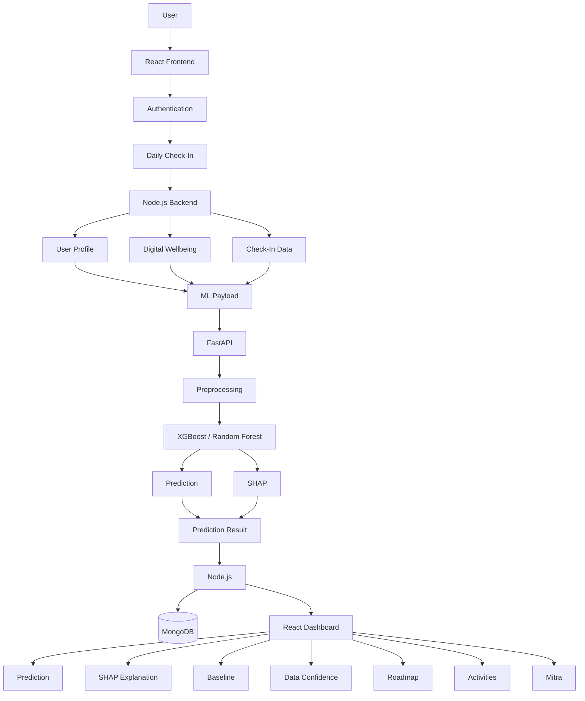

---

# 🔄 Check-In Example

Suppose a user enters:

```text
Sleep Duration = 5.5 hours
Stress Level = 8
Physical Activity = 20 minutes
```

and has digital wellbeing information.

The flow becomes:

```text
User
 ↓
React Check-In
 ↓
Node.js
 ↓
Profile + Digital Wellbeing + Check-In
 ↓
ML Payload
 ↓
FastAPI
 ↓
Preprocessing
 ↓
ML Model
 ↓
Prediction
 ↓
SHAP
 ↓
Explanation
 ↓
Node.js
 ↓
MongoDB
 ↓
React Dashboard
```

The dashboard can then display:

```text
Prediction
+
Top Contributing Factors
+
Data Confidence
+
Baseline Change
+
Wellness Activities
+
Daily Roadmap
```

---

# 🧪 Testing

MindMitra includes testing across multiple layers.

---

# 🔧 Backend Testing

Backend tests cover:

- Authentication
- Registration
- Login
- Profile validation
- Check-in processing
- Data ownership
- Digital wellbeing mapping
- Data confidence
- Roadmap generation
- Chatbot fallback
- Protected API routes

---

# 🐍 ML Testing

ML tests cover:

- Dataset preprocessing
- Feature transformation
- Model loading
- Prediction
- SHAP explanation
- Saved artifact loading
- Feature mapping

---

# 🚀 FastAPI Testing

FastAPI tests cover:

```text
GET /health
POST /predict
```

including:

- Valid prediction
- Missing fields
- Invalid values
- Invalid types
- Malformed requests
- Artifact loading failure
- Prediction service errors

---

# 🔄 End-to-End Testing

The main end-to-end flow validates:

```text
Authentication
      ↓
Profile
      ↓
Check-In
      ↓
ML Payload
      ↓
FastAPI
      ↓
Prediction
      ↓
SHAP
      ↓
Data Confidence
      ↓
MongoDB
      ↓
Frontend
```

---

# 🧪 Validation Performed

The application has been validated for:

- Authentication
- JWT protection
- User ownership
- Profile validation
- Check-in submission
- ML payload construction
- Digital wellbeing mapping
- Prediction generation
- SHAP explanation
- Data confidence
- MongoDB persistence
- Roadmap generation
- Chatbot fallback
- Frontend build
- FastAPI health
- FastAPI prediction
- Error handling

---

# 🛡️ Error Handling

The application handles situations such as:

```text
Invalid Login
Invalid Profile Data
Missing Check-In Fields
Invalid ML Input
FastAPI Unavailable
ML Artifact Loading Failure
MongoDB Unavailable
Invalid JWT
Unauthorized Resource Access
Chatbot Provider Failure
```

---

# 🔄 Graceful ML Failure

If the ML service becomes temporarily unavailable, the check-in information can still be preserved while the prediction failure is handled separately.

This prevents a temporary ML-service problem from automatically causing loss of user-submitted information.

---

# 🤖 Chatbot Failure Handling

If an external LLM provider is unavailable or no API key is configured, the chatbot layer can use a fallback behavior.

The core ML system remains independent from the chatbot.

```text
LLM Unavailable
      ↓
Core ML Prediction
      ↓
Can Still Operate
```

---

# 🚀 Running the Project

MindMitra uses multiple services.

The recommended local setup is:

```text
MongoDB
Node.js Backend
FastAPI ML Service
React Frontend
```

---

# 1️⃣ Start MongoDB

Make sure MongoDB is running locally.

Example local connection string:

```text
mongodb://127.0.0.1:27017/mindmitra
```

---

# 2️⃣ Start Backend

Open a terminal:

```bash
cd backend
npm install
node server.js
```

Backend:

```text
http://localhost:5000
```

---

# 3️⃣ Start FastAPI ML Service

Open another terminal from the project root:

```bash
python -m uvicorn ml_service.app:app --reload --port 8000
```

ML service:

```text
http://localhost:8000
```

Health endpoint:

```text
http://localhost:8000/health
```

---

# 4️⃣ Start Frontend

Open another terminal:

```bash
cd frontend
npm install
npm run dev
```

Frontend:

```text
http://localhost:5173
```

---

# ⚙️ Environment Variables

Create:

```text
backend/.env
```

Example:

```env
MONGODB_URI=mongodb://127.0.0.1:27017/mindmitra
PORT=5000
JWT_SECRET=your_local_secret
```

If an external AI provider is configured, its API key should also be stored in `.env`.

Example:

```env
GEMINI_API_KEY=your_api_key
```

Do not commit actual secrets to GitHub.

---

# 🚫 Files That Should Not Be Committed

The following should normally be excluded from Git:

```text
.env
node_modules/
ml_env/
__pycache__/
*.pyc
```

The Python virtual environment should remain local.

---

# 🧑‍💻 Development Environment

Recommended environment:

```text
Node.js
Python 3.11
MongoDB
Git
VS Code
```

The ML environment uses a dedicated Python virtual environment.

---

# 🔄 Development Workflow

The project development workflow is:

```text
1. Dataset Profiling
        ↓
2. Data Preprocessing
        ↓
3. Feature Engineering
        ↓
4. Model Training
        ↓
5. Model Evaluation
        ↓
6. SHAP Explainability
        ↓
7. FastAPI ML Service
        ↓
8. Node.js Integration
        ↓
9. MongoDB Integration
        ↓
10. React Integration
        ↓
11. Authentication
        ↓
12. Personalization
        ↓
13. Testing
        ↓
14. Final Application
```

---

# 🧱 Software Architecture Principles

MindMitra follows several software engineering principles.

## Separation of Concerns

Frontend, backend, database, ML, and AI components are separated.

---

## Modularity

Features are divided into reusable modules.

---

## Reusability

Reusable React components and backend services are used.

---

## Maintainability

The project separates:

```text
Routes
Controllers
Services
Models
ML Training
ML Inference
Explainability
```

---

## Scalability

The separate FastAPI ML service allows the Python ML system to evolve independently from the JavaScript backend.

---

# ⚠️ Limitations

## 1. Synthetic Dataset

The current ML experiments use synthetic data.

Therefore, results should not be presented as evidence from real-world participants.

---

## 2. Proxy Target

`felt_rested` is used as a proxy for a rested/fatigue-related state.

It is not a clinically validated wellbeing measurement.

---

## 3. No Verified Chronological Sequence

The source dataset does not establish a verified chronological sequence of measurements for users.

Therefore, the model demonstrates associations in the dataset rather than proving temporal causation or guaranteed future forecasting.

---

## 4. Synthetic Relationships

The dataset contains strong deterministic relationships between some variables and target values.

This contributes to unusually high model performance.

---

## 5. Digital Wellbeing Restrictions

Automatic phone-level digital wellbeing tracking requires authorized platform APIs and permissions.

---

## 6. Generalization

Strong performance on the current synthetic dataset does not establish real-world generalization.

---

## 7. Chatbot Limitations

The AI Companion is intended for general wellness guidance and explanation.

It is not a medical or psychological diagnostic system.

---

# 🔐 Ethical and Privacy Considerations

MindMitra handles personal wellbeing-related information, so privacy is important.

---

## Data Minimization

Only information required for the application's intended functionality should be collected.

---

## Authentication

Protected information should only be available to authenticated users.

---

## User Ownership

Users should only be able to access their own protected records.

---

## Password Security

Passwords should be hashed using bcrypt rather than stored in plain text.

---

## Consent

If real human-subject data is collected in future research, appropriate informed consent and institutional/ethical approval should be obtained.

---

## Digital Data

Phone and application usage information should only be collected through authorized mechanisms.

---

# 🚫 Medical Safety Position

MindMitra is intentionally not positioned as a diagnostic system.

The application does not claim to:

- Diagnose depression
- Diagnose anxiety
- Diagnose mental illness
- Replace a doctor
- Replace a psychologist
- Predict a medical condition

The project focuses on:

> Personal wellbeing monitoring, rested/fatigue-related prediction, explainability, and general wellness guidance.

---

# 🔮 Future Scope

## 📱 1. Android Digital Wellbeing Integration

Future versions can integrate authorized Android data sources such as:

- Health Connect
- UsageStatsManager
- Appropriate platform APIs

---

# 📊 2. Longitudinal Real-User Data

Future research can collect longitudinal data using:

- Informed consent
- Anonymized identifiers
- Appropriate ethical approval
- Secure storage
- Data minimization

---

# 🔄 3. Periodic Model Retraining

Future versions can periodically retrain models using appropriately collected and validated data.

The current system does not automatically retrain from every user check-in.

---

# 👤 4. Personalized Models

Future versions can explore:

```text
Global Model
     +
Personal Baseline
     +
User-Specific Calibration
```

---

# 📈 5. Better Uncertainty Estimation

Future work can introduce more rigorous uncertainty estimation around predictions.

---

# 🌎 6. External Validation

The models should be tested on independent datasets to evaluate generalization.

---

# 📱 7. Mobile Companion

An Android application could provide authorized access to:

- Screen time
- Application usage
- Activity
- Sleep-related information
- Health-related information where permitted

---

# 🔐 8. Privacy-Preserving ML

Future research could explore:

- Federated learning
- Differential privacy
- On-device inference
- Secure aggregation

where appropriate.

---

# ☁️ 9. Deployment

The current project is primarily developed and tested locally.

A future deployment architecture could be:

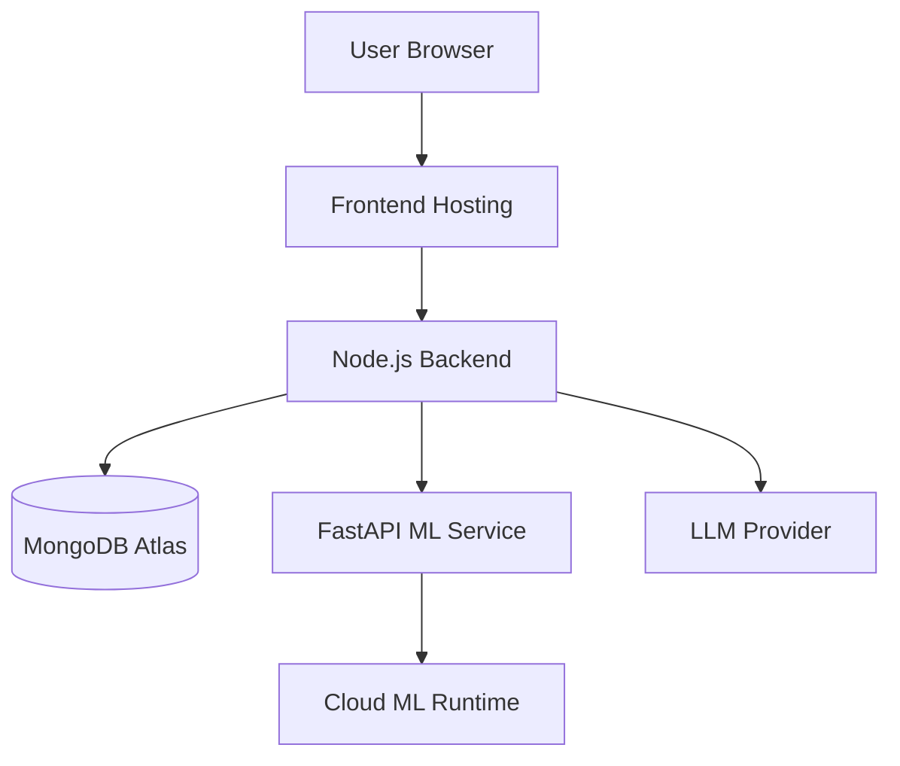

Deployment is considered future scope for the current academic implementation.

---

# 🔬 Research Interpretation

MindMitra should currently be interpreted as a technical prototype demonstrating:

```text
Data
 ↓
Machine Learning
 ↓
Prediction
 ↓
Explainability
 ↓
Personalization
 ↓
Wellness Guidance
```

It does not establish a clinically validated wellbeing prediction system.

---

# 📌 Important Dataset Interpretation

The dataset does not establish a verified chronological sequence of measurements for individual users.

Therefore, the `felt_rested` variable is used as a proxy for a rested/fatigue-related state.

The model results should be interpreted as associations learned from the available synthetic dataset rather than evidence of temporal causation.

---

# 🔬 Model Audit

The ML development process considered:

- Target leakage
- Synthetic relationships
- Missing values
- Hardcoded inputs
- Input provenance
- Train/test separation
- Feature transformations
- Model artifacts
- Explainability consistency

The final application uses provenance tracking so fallback values can be distinguished from actual user/profile/digital information.

---

# 🧠 Feature Importance Observation

The trained models showed strong dependence on a small number of variables.

For the felt-rested model:

```text
Sleep Duration
Stress Level
Night Screen Time
```

were among the dominant variables.

For the cognitive-performance model:

```text
Felt-Rested Score
Physical Activity
Alcohol Consumption
```

showed strong model importance.

These observations are model- and dataset-specific.

They should not automatically be interpreted as causal or universal real-world relationships.

---

# 🧩 ML vs Rule-Based vs LLM Components

MindMitra intentionally uses different techniques for different tasks.

## Machine Learning

Used for:

```text
Numerical Prediction
```

---

## SHAP

Used for:

```text
Model Explanation
```

---

## Rule-Based Logic

Used for:

```text
Personal Baseline
Roadmap Generation
Activity Recommendation
Change Messages
```

---

## LLM

Used for:

```text
Natural Language Explanation
General Wellness Guidance
Conversational Interaction
```

This separation makes the architecture easier to understand and test.

---

# 🏛️ Complete System Architecture

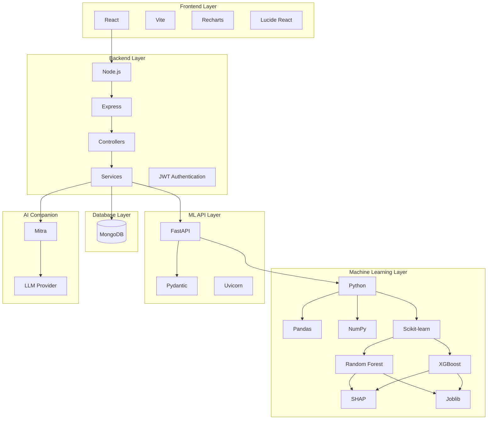

---

# 🧠 MindMitra Core Concept

```text
                         MINDMITRA
                             │
             ┌───────────────┼───────────────┐
             │               │               │
             ▼               ▼               ▼
         PREDICT          EXPLAIN        PERSONALIZE
             │               │               │
             ▼               ▼               ▼
            ML              SHAP          BASELINE
             │               │               │
             └───────────────┼───────────────┘
                             │
                             ▼
                     WELLNESS GUIDANCE
                             │
                             ▼
                       DAILY ROADMAP
                             │
                             ▼
                      MITRA COMPANION
```

---

# 🔄 Final End-to-End Pipeline

```text
User
  ↓
Authentication
  ↓
Check-In
  ↓
Profile
  ↓
Digital Wellbeing
  ↓
Mood
  ↓
Node.js Backend
  ↓
Input Provenance
  ↓
Data Confidence
  ↓
ML Payload
  ↓
FastAPI
  ↓
Preprocessing
  ↓
Random Forest / XGBoost
  ↓
Prediction
  ↓
SHAP
  ↓
Explanation
  ↓
MongoDB
  ↓
Personal Baseline
  ↓
Change Detection
  ↓
Wellness Activities
  ↓
Personalized Roadmap
  ↓
Mitra AI Companion
  ↓
React Dashboard
```

---

# 📊 Project Highlights

MindMitra combines:

```text
✅ React Frontend
✅ Vite
✅ Node.js
✅ Express
✅ MongoDB
✅ Mongoose
✅ Python
✅ Pandas
✅ NumPy
✅ Scikit-learn
✅ Random Forest
✅ XGBoost
✅ SHAP
✅ FastAPI
✅ JWT Authentication
✅ bcrypt
✅ Personal Baseline
✅ Change Detection
✅ Digital Wellbeing
✅ Mood Diary
✅ Wellness Activities
✅ Personalized Roadmap
✅ Data Confidence
✅ Mitra AI Companion
✅ REST APIs
✅ End-to-End Testing
```

---

# 🎓 Academic Value

MindMitra demonstrates the integration of multiple CSE concepts.

## Machine Learning

- Regression
- Data preprocessing
- Feature engineering
- Train/test split
- Model comparison
- Model evaluation
- Model serialization

## Explainable AI

- SHAP
- Local explanations
- Feature contributions
- Model interpretation

## Full-Stack Development

- React
- Node.js
- Express
- MongoDB
- REST APIs

## Python Backend

- FastAPI
- ML inference

## Software Engineering

- Modular architecture
- Separation of concerns
- Authentication
- Error handling
- Testing
- Documentation

## Data Engineering

- Data cleaning
- Preprocessing
- Feature transformation
- Provenance tracking
- Data completeness

---

# 🎯 Project Contribution

The main contribution of MindMitra is the integration of multiple components into a single application:

```text
Machine Learning
       +
Explainable AI
       +
Personal Baseline
       +
Digital Wellbeing
       +
Mood Tracking
       +
Wellness Activities
       +
Personalized Roadmap
       +
Conversational AI
       +
Full-Stack Web Application
```

Instead of treating prediction as an isolated ML task, the project connects the complete pipeline from data input to user-facing explanation and guidance.

---

# 🏁 Conclusion

MindMitra demonstrates how Machine Learning, Explainable AI, personalization, and modern full-stack development can be combined to create a personal wellbeing-monitoring application.

The complete system connects:

```text
User
 ↓
Check-In
 ↓
Personal Data
 ↓
Digital Wellbeing
 ↓
ML Prediction
 ↓
SHAP Explanation
 ↓
Personal Baseline
 ↓
Data Confidence
 ↓
Wellness Activities
 ↓
Daily Roadmap
 ↓
AI Companion
```

The project emphasizes that an AI system should not only produce an output but should also provide understandable context around that output.

The current implementation demonstrates the complete technical pipeline from:

```text
Dataset
 ↓
Preprocessing
 ↓
Model Training
 ↓
Evaluation
 ↓
Explainability
 ↓
FastAPI
 ↓
Node.js
 ↓
MongoDB
 ↓
React
```

The project also clearly recognizes the limitations of using a synthetic dataset and a proxy target.

---

# 📌 One-Line Project Summary

> **MindMitra is an Explainable AI-based personal wellbeing monitoring system that predicts a rested/fatigue-related state, explains the prediction using SHAP, compares the user's current pattern with their personal baseline, and provides personalized wellness guidance through a full-stack web application.**

---

# 📌 Short Project Description

MindMitra is a full-stack AI-powered wellbeing monitoring platform developed using React, Node.js, Express, MongoDB, Python, FastAPI, Scikit-learn, XGBoost, and SHAP. It predicts a rested/fatigue-related state, provides explainable predictions, tracks personal baselines, incorporates digital wellbeing and mood information, and generates personalized wellness activities and daily roadmaps.

---

# ⚖️ Disclaimer

MindMitra is developed for educational, research, and personal wellbeing-monitoring purposes.

It is not a medical diagnosis, treatment, or clinical decision-support system.

The `felt_rested` variable is used as a proxy for a rested/fatigue-related state and is not a clinically validated wellbeing measurement.

The current machine-learning experiments use a synthetic dataset. Therefore, reported model performance should not be interpreted as clinical accuracy or guaranteed real-world performance.

SHAP explanations describe the behavior of the trained machine-learning model and should not be interpreted as proof of real-world causation.

The Mitra AI Companion provides general wellness-oriented information and should not be treated as a replacement for qualified medical or mental-health professionals.

---

# 👩‍💻 MindMitra

## Explainable AI-Based Personal Wellbeing Monitoring and Prediction System

### Core Philosophy

```text
PREDICT
   ↓
EXPLAIN
   ↓
PERSONALIZE
   ↓
GUIDE
```

### Technology

```text
React
+
Node.js
+
Express
+
MongoDB
+
Python
+
FastAPI
+
Scikit-learn
+
XGBoost
+
SHAP
```

---

# ⭐ Final Architecture Summary

```text
                         ┌─────────────────────┐
                         │       USER          │
                         └──────────┬──────────┘
                                    │
                                    ▼
                         ┌─────────────────────┐
                         │   REACT FRONTEND    │
                         └──────────┬──────────┘
                                    │
                              REST API
                                    │
                                    ▼
                         ┌─────────────────────┐
                         │ NODE + EXPRESS      │
                         └──────┬───────┬──────┘
                                │       │
                                │       │
                                ▼       ▼
                         ┌──────────┐  ┌──────────────┐
                         │ MongoDB  │  │   FastAPI    │
                         └──────────┘  └──────┬───────┘
                                              │
                                              ▼
                                      ┌───────────────┐
                                      │ Preprocessing │
                                      └───────┬───────┘
                                              │
                                              ▼
                                      ┌───────────────┐
                                      │ ML Prediction │
                                      │ RF / XGBoost  │
                                      └───────┬───────┘
                                              │
                                  ┌───────────┴───────────┐
                                  │                       │
                                  ▼                       ▼
                           ┌────────────┐          ┌────────────┐
                           │ Prediction │          │    SHAP    │
                           └─────┬──────┘          └─────┬──────┘
                                 │                       │
                                 └───────────┬───────────┘
                                             │
                                             ▼
                                      ┌─────────────┐
                                      │ Explanation │
                                      └──────┬──────┘
                                             │
                                             ▼
                                      ┌─────────────┐
                                      │Personalized │
                                      │   Guidance  │
                                      └──────┬──────┘
                                             │
                       ┌─────────────────────┼─────────────────────┐
                       │                     │                     │
                       ▼                     ▼                     ▼
                 ┌──────────┐         ┌───────────┐        ┌────────────┐
                 │ Baseline │         │ Activities│        │  Roadmap   │
                 └──────────┘         └───────────┘        └────────────┘
                                             │
                                             ▼
                                      ┌─────────────┐
                                      │    MITRA    │
                                      │ AI Companion│
                                      └─────────────┘
```

---

# 🌟 MindMitra

> **An Explainable AI-Based Personal Wellbeing Monitoring and Prediction System**

**Predict. Explain. Personalize. Guide.**
